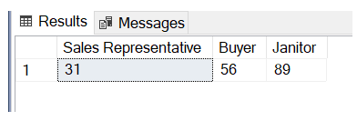
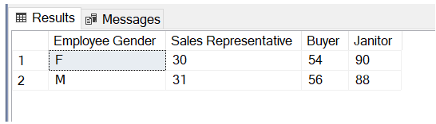

# SQL advanced exercise
## Used  VScode, MS SQL , dataset of AdeventureWorks2019

#### Exercise 1
    Create a query with the following columns:
    1. FirstName and LastName, from the Person.Person table**
    2. JobTitle, from the HumanResources.Employee table**
    3. Rate, from the HumanResources.EmployeePayHistory table**
    4. A derived column called "AverageRate" that returns the average of all values in the "Rate" column, in each row

    **All the above tables can be joined on BusinessEntityID
    - All the tables can be inner joined, and you do not need to apply any criteria.

#### Exercise 2
    Enhance your query from Exercise 1 by adding a derived column called
    "MaximumRate" that returns the largest of all values in the "Rate" column, in each row.

#### Exercise 3
    Enhance your query from Exercise 2 by adding a derived column called
    "DiffFromAvgRate" that returns the result of the following calculation:
    An employees's pay rate, MINUS the average of all values in the "Rate" column.

#### Exercise 4
    Enhance your query from Exercise 3 by adding a derived column called
    "PercentofMaxRate" that returns the result of the following calculation:
    An employees's pay rate, DIVIDED BY the maximum of all values in the "Rate" column, times 100.

## PARTITION BY

#### Exercise 1
    Create a query with the following columns:
    1. “Name” from the Production.Product table, which can be alised as “ProductName”
        “ListPrice” from the Production.Product table
        “Name” from the Production. ProductSubcategory table, which can be alised as “ProductSubcategory”*
        “Name” from the Production.ProductCategory table, which can be alised as “ProductCategory”**

*Join Production.ProductSubcategory to Production.Product on “ProductSubcategoryID”
**Join Production.ProductCategory to ProductSubcategory on “ProductCategoryID”

All the tables can be inner joined, and you do not need to apply any criteria.

#### Exercise 2
    Enhance your query from Exercise 1 by adding a derived column called
    "AvgPriceByCategory " that returns the average ListPrice for the product category in each given row.

#### Exercise 3
    Enhance your query from Exercise 2 by adding a derived column called
    "AvgPriceByCategoryAndSubcategory" that returns the average ListPrice for the product category AND subcategory in each given row.

#### Exercise 4
    Enhance your query from Exercise 3 by adding a derived column called
    "ProductVsCategoryDelta" that returns the result of the following calculation:
    A product's list price, MINUS the average ListPrice for that product’s category.

## ROW_NUMBER()
#### Exercise 1
    Create a query with the following columns (feel free to borrow your code from Exercise 1 of the PARTITION BY exercises):

    “Name” from the Production.Product table, which can be alised as “ProductName”
    “ListPrice” from the Production.Product table
    “Name” from the Production. ProductSubcategory table, which can be alised as “ProductSubcategory”*
    “Name” from the Production.ProductCategory table, which can be alised as “ProductCategory”**
    *Join Production.ProductSubcategory to Production.Product on “ProductSubcategoryID”
    **Join Production.ProductCategory to ProductSubcategory on “ProductCategoryID”

    All the tables can be inner joined, and you do not need to apply any criteria.

#### Exercise 2
    Enhance your query from Exercise 1 by adding a derived column called

    "Price Rank " that ranks all records in the dataset by ListPrice, in descending order. That is to say, the product with the most expensive price should have a rank of 1, and the product with the least expensive price should have a rank equal to the number of records in the dataset.
#### Exercise 3
    Enhance your query from Exercise 2 by adding a derived column called

    "Category Price Rank" that ranks all products by ListPrice – within each category - in descending order. In other words, every product within a given category should be ranked relative to other products in the same category.

#### Exercise 4
    Enhance your query from Exercise 3 by adding a derived column called

    "Top 5 Price In Category" that returns the string “Yes” if a product has one of the top 5 list prices in its product category, and “No” if it does not. You can try incorporating your logic from Exercise 3 into a CASE statement to make this work.

    Resources for this lecture

# RANK and DENSE_RANK - Exercises
#### Exercise 1
    Using your solution query to Exercise 4 from the ROW_NUMBER exercises as a staring point, add a derived column called “Category Price Rank With Rank” that uses the RANK function to rank all products by ListPrice – within each category - in descending order. Observe the differences between the “Category Price Rank” and “Category Price Rank With Rank” fields.

#### Exercise 2
    Modify your query from Exercise 2 by adding a derived column called "Category Price Rank With Dense Rank" that that uses the DENSE_RANK function to rank all products by ListPrice – within each category - in descending order. Observe the differences among the “Category Price Rank”, “Category Price Rank With Rank”, and “Category Price Rank With Dense Rank” fields.

#### Exercise 3
    Examine the code you wrote to define the “Top 5 Price In Category” field back in the ROW_NUMBER exercises. Now that you understand the differences among ROW_NUMBER, RANK, and DENSE_RANK, consider which of these functions would be most appropriate to return a true top 5 products by price, assuming we want to see the top 5 distinct prices AND we want “ties” (by price) to all share the same rank.

# LEAD and LAG - Exercises
#### Exercise 1
    Create a query with the following columns:
    “PurchaseOrderID” from the Purchasing.PurchaseOrderHeader table
    “OrderDate” from the Purchasing.PurchaseOrderHeader table
    “TotalDue” from the Purchasing.PurchaseOrderHeader table
    “Name” from the Purchasing.Vendor table, which can be aliased as “VendorName”*
    *Join Purchasing.Vendor to Purchasing.PurchaseOrderHeader on BusinessEntityID = VendorID

    Apply the following criteria to the query:
    Order must have taken place on or after 2013
    TotalDue must be greater than $500

#### Exercise 2
    Modify your query from Exercise 1 by adding a derived column called
    "PrevOrderFromVendorAmt", that returns the “previous” TotalDue value (relative to the current row) within the group of all orders with the same vendor ID. We are defining “previous” based on order date.

#### Exercise 3
    Modify your query from Exercise 2 by adding a derived column called
    "NextOrderByEmployeeVendor", that returns the “next” vendor name (the “name” field from Purchasing.Vendor) within the group of all orders that have the same EmployeeID value in Purchasing.PurchaseOrderHeader. Similar to the last exercise, we are defining “next” based on order date.

#### Exercise 4
    Modify your query from Exercise 3 by adding a derived column called "Next2OrderByEmployeeVendor" that returns, within the group of all orders that have the same EmployeeID, the vendor name offset TWO orders into the “future” relative to the order in the current row. The code should be very similar to Exercise 3, but with an extra argument passed to the Window Function used.

# FIRST_VALUE - Exercises
#### Exercise 1
    Create a query that returns all records - and the following columns - from the HumanResources.Employee table:

    a. BusinessEntityID (alias this as “EmployeeID”)
    b. JobTitle
    c. HireDate
    d. VacationHours

    To make the effect of subsequent steps clearer, also sort the query output by "JobTitle" and HireDate, both in ascending order.

    Now add a derived column called “FirstHireVacationHours” that displays – for a given job title – the amount of vacation hours possessed by the first employee hired who has that same job title. For example, if 5 employees have the title “Data Guru”, and the one of those 5 with the oldest hire date has 99 vacation hours, “FirstHireVacationHours” should display “99” for all 5 of those employees’ corresponding records in the query.

Exercise 2
    Create a query with the following columns:

    a. “ProductID” from the Production.Product table
    b. “Name” from the Production.Product table (alias this as “ProductName”)
    c. “ListPrice” from the Production.ProductListPriceHistory table
    d. “ModifiedDate” from the Production.ProductListPriceHistory

    You can join the Production.Product and Production.ProductListPriceHistory tables on "ProductID".

    Note that the Production.ProductListPriceHistory table contains a distinct record for every different price a product has been listed at. This means that a single product ID may have several records in this table – one for every list price it has had.

    Also note that the “ModifiedDate” field in this table displays the effective date of each of these prices. So if there are 3 rows in the table for product ID 12345, the row with the oldest modified date also contains the first price in the associated product’s history. Conversely, the row with the most recent modified date also contains the current price of the product.

    To make the effect of subsequent steps clearer, also sort the query output by ProductID and ModifiedDate, both in ascending order.

    Now add a derived column called “HighestPrice” that displays – for a given product – the highest price that product has been listed at. So even if there are 4 records for a given product, this column should only display the all-time highest list price for that product in each of those 4 rows.

    Similarly, create another derived column called “LowestCost” that displays the all-time lowest price for a given product.

    Finally, create a third derived column called “PriceRange” that reflects, for a given product, the difference between its highest and lowest ever list prices.

# Introducing Subqueries - Exercises
#### Exercise 1

    Write a query that displays the three most expensive orders, per vendor ID, from the Purchasing.PurchaseOrderHeader table. There should ONLY be three records per Vendor ID, even if some of the total amounts due are identical. "Most expensive" is defined by the amount in the "TotalDue" field.

    Include the following fields in your output:
    PurchaseOrderID
    VendorID
    OrderDate
    TaxAmt
    Freight
    TotalDue

    Hints:
    You will first need to define a field that assigns a unique rank to every purchase order, within each group of like vendor IDs.
    You'll probably want to use a Window Function with PARTITION BY and ORDER BY to do this.
    The last step will be to apply the appropriate criteria to the field you created with your Window Function.

#### Exercise 2

    Modify your query from the first problem, such that the top three purchase order amounts are returned, regardless of how many records are returned per Vendor Id.

    In other words, if there are multiple orders with the same total due amount, all should be returned as long as the total due amount for these orders is one of the top three.

    Ultimately, you should see three distinct total due amounts (i.e., the top three) for each group of like Vendor Ids. However, there could be multiple records for each of these amounts.

    Hint: Think carefully about how the different ranking functions (ROW_NUMBER, RANK, and DENSE_RANK) work, and which one might be best suited to help you here.

    Resources for this lecture

# ROWS BETWEEN - Exercises
#### Exercise 1

    Create a query with the following columns:

    “OrderMonth”, a derived column (you’ll have to create this one yourself) featuring the month number corresponding with the Order Date in a given row

    “OrderYear”, a derived column featuring the year corresponding with the Order Date in a given row

    “SubTotal” from the Purchasing.PurchaseOrderHeader table

    Your query should be an aggregate query – specifically, it should sum “SubTotal”, and group by the remaining fields.

#### Exercise 2

    Modify your query from Exercise 1 by adding a derived column called "Rolling3MonthTotal", that displays  - for a given row - a running total of “SubTotal” for the prior three months (including the current row).

    HINT: You will need to include multiple fields in your ORDER BY to get this to work!

#### Exercise 3

    Modify your query from Exercise 3 by adding another derived column called "MovingAvg6Month", that calculates a rolling average of “SubTotal” for the previous 6 months, relative to the month in the “current” row. Note that this average should NOT include the current row.

#### Exercise 4

    Modify your query from Exercise 3 by adding (yet) another derived column called “MovingAvgNext2Months” , that calculates a rolling average of “SubTotal” for the month in the current row and the next two months after that. This moving average will provide a kind of "forecast" for Subtotal by month.

    Resources for this lecture

# Scalar Subqueries - Exercises
#### Exercise 1

    Create a query that displays all rows and the following columns from the AdventureWorks2019.HumanResources.Employee table:

    BusinessEntityID
    JobTitle
    VacationHours

    Also include a derived column called "MaxVacationHours" that returns the maximum amount of vacation hours for any one employee, in any given row.

#### Exercise 2

    Add a new derived field to your query from Exercise 1, which returns the percent an individual employees' vacation hours are, of the maximum vacation hours for any employee. For example, the record for the employee with the most vacation hours should have a value of 1.00, or 100%, in this column.

    Hints:
    You can repurpose your logic from "MaxVacationHours" for the denominator.
    Make sure you multiply at least one side of your equation by 1.0, to ensure the output will be a decimal.

#### Exercise 3

    Refine your output with a criterion in the WHERE clause that filters out any employees whose vacation hours are less then 80% of the maximum amount of vacation hours for any one employee. In other words, return only employees who have at least 80% as much vacation time as the employee with the most vacation time.

    Hint: The query should return 60 rows.

# Correlated Subqueries - Exercises
#### Exercise 1

    Write a query that outputs all records from the Purchasing.PurchaseOrderHeader table. Include the following columns from the table:

    PurchaseOrderID
    VendorID
    OrderDate
    TotalDue

    Add a derived column called NonRejectedItems which returns, for each purchase order ID in the query output, the number of line items from the Purchasing.PurchaseOrderDetail table which did not have any rejections (i.e., RejectedQty = 0). Use a correlated subquery to do this.

#### Exercise 2

    Modify your query to include a second derived field called MostExpensiveItem.

    This field should return, for each purchase order ID, the UnitPrice of the most expensive item for that order in the Purchasing.PurchaseOrderDetail table.

    Use a correlated subquery to do this as well.

    Hint: Think of the most appropriate aggregate function to use in the correlated subquery for this scenario.

# EXISTS - Exercises
#### Exercise 1

    Select all records from the Purchasing.PurchaseOrderHeader table such that there is at least one item in the order with an order quantity greater than 500. The individual items tied to an order can be found in the Purchasing.PurchaseOrderDetail table.

    Select the following columns:
    PurchaseOrderID
    OrderDate
    SubTotal
    TaxAmt
Sort by purchase order ID.

#### Exercise 2

    Modify your query from Exercise 1 as follows:

    Select all records from the Purchasing.PurchaseOrderHeader table such that there is at least one item in the order with an order quantity greater than 500, AND a unit price greater than $50.00.

    Select ALL columns from the Purchasing.PurchaseOrderHeader table for display in your output.

    Even if you have aliased this table to enable the use of a JOIN or EXISTS, you can still use the SELECT * shortcut to do this. Assuming you have aliased your table "A", simply use "SELECT A.*" to select all columns from that table.

Exercise 3

    Select all records from the Purchasing.PurchaseOrderHeader table such that NONE of the items within the order have a rejected quantity greater than 0.

    Select ALL columns from the Purchasing.PurchaseOrderHeader table using the "SELECT *" shortcut.    

# FOR XML PATH With STUFF - Exercises
#### Exercise 1

    Create a query that displays all rows from the Production.ProductSubcategory table, and includes the following fields:

    The "Name" field from Production.ProductSubcategory, which should be aliased as "SubcategoryName"

    A derived field called "Products" which displays, for each Subcategory in Production.ProductSubcategory, a semicolon-separated list of all products from Production.Product contained within the given subcategory

    Hint: Production.ProductSubcategory and Production.Product are related by the "ProductSubcategoryID" field.

#### Exercise 2

    Modify the query from Exercise 1 such that only products with a ListPrice value greater than $50 are listed in the "Products" field.

    Hint: Assuming you used a correlated subquery in Exercise 1, keep in mind that you can apply additional criteria to it, just as with any other correlated subquery.

    NOTE: Your query should still include ALL product subcategories, but only list associated products greater than $50. But since there are certain product subcategories that don't have any associated products greater than $50, some rows in your query output may have a NULL value in the product field.

# PIVOT - Exercises
#### Exercise 1

    Using PIVOT, write a query against the HumanResources.Employee table
    that summarizes the average amount of vacation time for Sales Representatives, Buyers, and Janitors.
    Your output should look like the image below.

#### Exercise 2

    Modify your query from Exercise 1 such that the results are broken out by Gender. Alias the Gender field as "Employee Gender" in your output.

    Your output should look like the image below:

